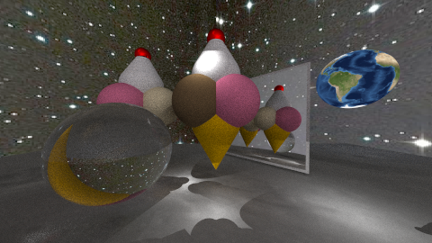

# Java Raytracer

## About

This is a _Java_ application which generates an image. It uses [ray tracing](https://en.wikipedia.org/wiki/Ray_tracing_(graphics)) for creating a high degree of realism and some nice visual effects within the image.

### Example

`example-1.png`: This is an example of an image renderd with this ray tracer

## Prerequisites

Java has to be installed on your machine.

## Getting started

From a unix console just run

```shell
$ make run
```

from the root directory to compile the Java classes in the `src` directory and run the program. 

This will create the example-image shown earlier.

## Make your own image

To create a different image go to the main class in `src/raytracer/raytracer` and change the `buildScene()` method how you like.

To change the image quality set the `SAMPLING_RATE` in this class to a higher number.

> Please note: this will increase render time... a lot!


## License & acknowledgement

**Please acknowledge:** This project was created as part of a course at [Beuth University](http://www.beuth-hochschule.de/)